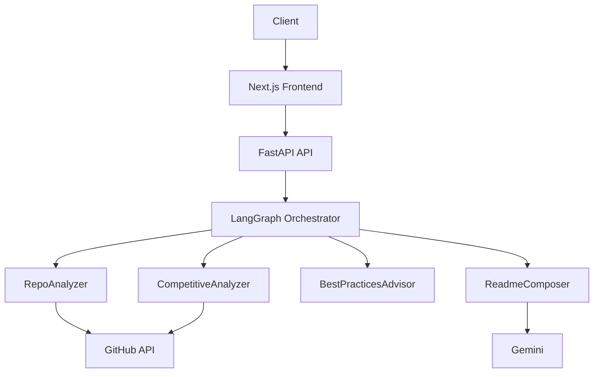
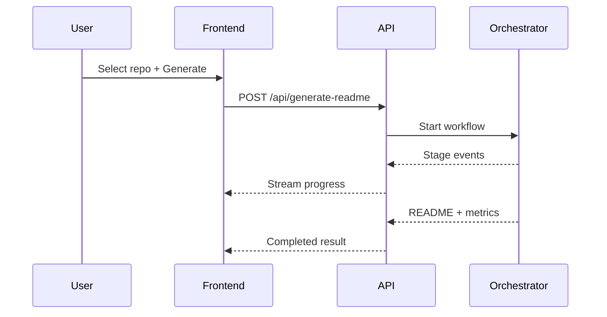
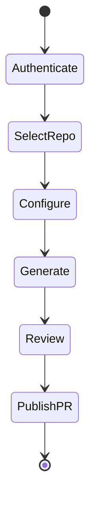
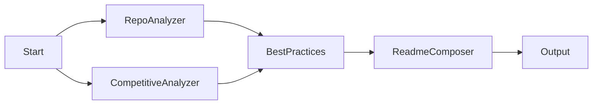
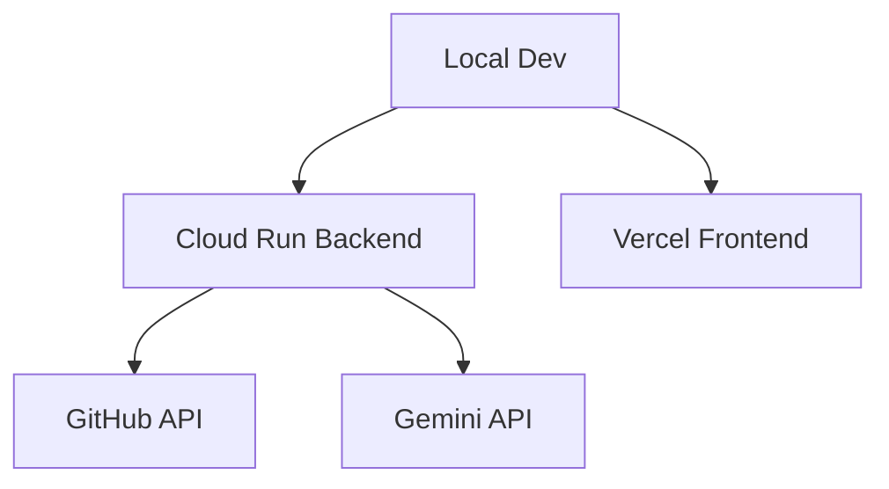

# 🤖 git-developer

**AI-Powered Professional README Generator for GitHub Repositories**

[](./LICENSE)
[](https://www.python.org/downloads/)
[](https://nodejs.org/)


`git-developer` delivers enterprise-grade README generation through a multi-agent pipeline that analyzes repository context and composes production-ready documentation.

## Table of Contents
- [Quick Overview](#quick-overview)
- [Demo and Screenshot Flow](#demo-and-screenshot-flow)
- [Key Features](#key-features)
- [Architecture](#architecture)
- [Tech Stack](#tech-stack)
- [Installation and Setup](#installation-and-setup)
- [Quick Start and Usage Guide](#quick-start-and-usage-guide)
- [API Reference](#api-reference)
- [Project Structure](#project-structure)
- [Configuration](#configuration)
- [Contributing](#contributing)
- [Roadmap and Future Enhancements](#roadmap-and-future-enhancements)
- [Troubleshooting](#troubleshooting)
- [License](#license)
- [Acknowledgments and Footer](#acknowledgments-and-footer)

## Quick Overview
`git-developer` is designed to reduce documentation bottlenecks by generating structured, professional README content from real repository signals. The workflow combines repository analysis, competitive benchmarking, and best-practice synthesis before final markdown composition.

The platform addresses a common engineering gap: code evolves faster than documentation. By automating documentation authoring with deterministic stages, teams can improve onboarding, reduce ambiguity, and keep repository narratives aligned with implementation reality.

This system is production-ready and suitable for teams that require repeatable output quality, fast iteration, and direct GitHub publishing controls through pull-request workflows.

## Demo and Screenshot Flow
Run backend and frontend locally, connect GitHub, select a repository, and generate. A progress stream shows each stage before the final README appears with metrics.

Success criteria:
- Token validation passes
- Repository list loads
- Generation reaches completed state
- README renders with metrics and can be published

## Key Features
`git-developer` uses LangGraph orchestration with four specialized agents to produce documentation that is contextual instead of generic. The pipeline starts with repository profiling, continues through competitor analysis, adds implementation best practices, and ends with professional markdown composition.

Competitive analysis identifies similar public projects and captures differentiators to strengthen README positioning. Real-time progress streaming provides operational visibility across each stage, so users can monitor status continuously.

GitHub integration supports authentication, repository discovery, generation, and PR publication with custom metadata. Each output includes quality indicators and a clean enterprise markdown layout suitable for immediate review.

## Architecture
### Diagram 1: System Architecture


### Diagram 2: README Generation Pipeline


### Diagram 3: Frontend User Flow


### Diagram 4: LangGraph Agent Orchestration


### Diagram 5: Deployment Architecture


## Tech Stack
- Python: requests==2.32.3, PyGithub==2.2.0, playwright==1.43.0, beautifulsoup4==4.12.3, fastapi==0.110.1, uvicorn==0.29.0, python-dotenv==1.0.1, pyyaml==6.0.1, google-genai==1.73.1, google-cloud-storage==2.16.0

## Installation and Setup
```bash
python -m venv venv
source venv/bin/activate
pip install -r requirements.txt
cd frontend && npm install && cd ..
```

## Quick Start and Usage Guide
```bash
python -m uvicorn api.main:app --reload --host 0.0.0.0 --port 8000
cd frontend && npm run dev
```

Run commands detected for this repo:
```bash
python3 scripts/run_pipeline.py
```

## API Reference
- `POST /api/auth/token`
- `POST /api/repos/list`
- `POST /api/generate-readme`
- `GET /api/job-status/{job_id}`
- `GET /api/generate-readme/{job_id}/stream`
- `POST /api/publish-readme`

## Project Structure
Core modules include `agents/`, `api/`, `orchestrator/`, `frontend/`, and `scripts/`.

## Configuration
Use `.env.local` for secrets and runtime config:
- `GITHUB_TOKEN`
- `GEMINI_API_KEY`
- `NEXT_PUBLIC_API_BASE_URL`

## Contributing
1. Fork the repository.
2. Create a feature branch.
3. Commit changes.
4. Push and open a PR.

## Roadmap and Future Enhancements
- GitHub OAuth
- Batch processing
- Generation history and restore
- PDF export
- Multi-language README generation

## Troubleshooting
- Token validation fails: verify token scopes.
- Repo not found: confirm visibility and URL.
- Timeout: retry and check backend logs.

## License
MIT License.

## Acknowledgments and Footer
Built with LangGraph, FastAPI, and Next.js. Powered by Gemini AI.

### Competitive Analysis
- [git-developer/fhem-examples](https://github.com/git-developer/fhem-examples) (⭐ 5): Examples for the home automation software FHEM
- [shajinashajahan116/https-github.developer.allianz.io-itmp-agcs-automation-itmp-agcs-testportfolio](https://github.com/shajinashajahan116/https-github.developer.allianz.io-itmp-agcs-automation-itmp-agcs-testportfolio) (⭐ 0): N/A

### Differentiators
- Single-repo focused README pipeline
- Structured profile -> deterministic markdown output
- Integrated publish-to-branch flow

### Best Practices
Do:
- Use feature branches and PR reviews for README updates.
- Keep generated README sections evidence-based from repo files.
- Validate setup commands before publishing README changes.

Avoid:
- Do not publish placeholder commands that are not runnable.
- Do not overwrite manual project notes without review.
