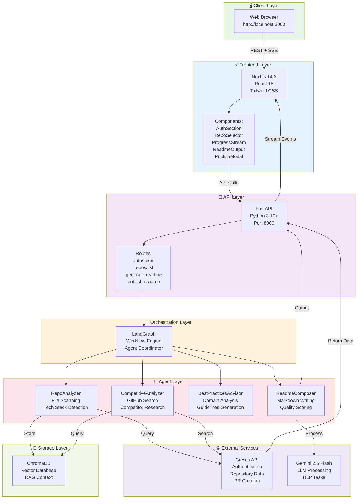
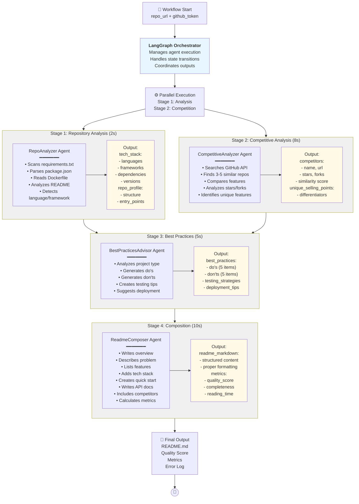
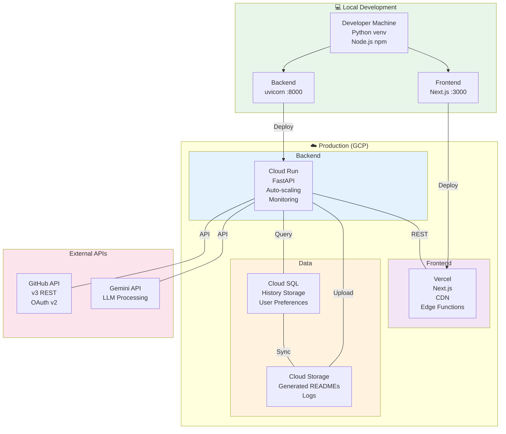

# 🤖 git-developer

**AI-Powered Professional README Generator for GitHub Repositories**

[](./LICENSE)
[](https://www.python.org/downloads/)
[](https://nodejs.org/)


`git-developer` transforms raw repository context into enterprise-grade README documentation using a multi-agent AI workflow, real-time progress tracking, and direct GitHub pull request publishing.

## Table of Contents

- [Quick Overview](#quick-overview)
- [Demo and Screenshot Flow](#demo-and-screenshot-flow)
- [Key Features](#key-features)
- [Architecture](#architecture)
  - [System Architecture](#diagram-1-system-architecture-high-level-overview)
  - [README Generation Pipeline](#diagram-2-readme-generation-pipeline)
  - [Frontend User Flow](#diagram-3-frontend-user-flow)
  - [LangGraph Agent Orchestration](#diagram-4-langgraph-agent-orchestration)
  - [Deployment Architecture](#diagram-5-deployment-architecture)
- [Tech Stack](#tech-stack)
- [Installation and Setup](#installation-and-setup)
- [Quick Start and Usage Guide](#quick-start-and-usage-guide)
- [API Reference](#api-reference)
- [Project Structure](#project-structure)
- [Configuration](#configuration)
- [Contributing](#contributing)
- [Roadmap and Future Enhancements](#roadmap-and-future-enhancements)
- [Troubleshooting](#troubleshooting)
- [License](#license)
- [Acknowledgments and Footer](#acknowledgments-and-footer)

## Quick Overview

`git-developer` is a production-oriented documentation intelligence platform that automates one of the most time-consuming parts of software delivery: writing and maintaining high-quality README files. Instead of relying on fragmented templates and manual edits, it analyzes repository structure, dependencies, conventions, and competitive context to generate polished, actionable documentation in minutes.

The platform addresses a common engineering bottleneck. Teams often ship code quickly but defer documentation quality, which creates onboarding friction, inconsistent standards, and avoidable support overhead. `git-developer` closes that gap by combining repository analysis, best-practice guidance, and structured composition into a single repeatable workflow.

At the core, the system uses LangGraph to coordinate four specialized agents, each responsible for a defined stage of the documentation lifecycle. This design improves output reliability, enables transparent stage-level progress updates, and supports enterprise requirements for traceability and deterministic orchestration.

The solution is designed for engineering teams, developer advocates, product organizations, and platform owners who need scalable documentation quality across multiple repositories. It is local-development friendly, cloud-deployment ready, and structured to support future expansion such as OAuth, batch processing, and organization-wide governance.

## Demo and Screenshot Flow

To run `git-developer` locally, start the backend and frontend services, authenticate using a GitHub Personal Access Token, select a repository, and trigger generation from the `/generate` page. The interface will stream live stage updates and return a complete README draft with quality metrics and publishing controls.

Expected output includes:
- A professionally structured README draft in markdown
- Real-time progress stage updates during generation
- Quality metrics such as completeness and estimated reading time
- One-click pull request creation for repository publication

Success criteria for a healthy run:
- Token validation returns connected status
- Repository list loads successfully
- Generation reaches completion without failure state
- README appears in preview and can be published as a PR

## Key Features

`git-developer` delivers AI-powered README generation by leveraging LangGraph orchestration with four specialized agents that work in a controlled sequence. The pipeline starts with repository introspection, expands into competitive landscape analysis, synthesizes best-practice recommendations, and concludes with structured markdown composition. This staged architecture ensures each output section is grounded in observed repository context rather than generic templates.

The competitive analysis engine automatically identifies and compares similar projects on GitHub to improve positioning clarity and feature communication quality. At the same time, the platform maintains live operational transparency through real-time progress streaming; Server-Sent Events provide stage updates across the generation lifecycle so users can monitor throughput and status without polling blind processes.

GitHub integration is designed for direct workflow execution: users authenticate, list repositories, generate content, and create pull requests with custom branch, commit message, PR title, and PR body metadata. Each generated README is also evaluated through quality-oriented metrics, and the final output is formatted for enterprise consumption with clean markdown structure, readable section hierarchy, code fencing, and syntax-safe composition.

## Architecture

The architecture is intentionally layered to separate interface concerns, orchestration logic, domain intelligence, and external platform dependencies. This enables faster iteration, safer changes, and clearer ownership boundaries across the codebase.

### Diagram 1: SYSTEM ARCHITECTURE (High-level overview)


**Key Components:**
- **Client Layer**: User's web browser accessing the Next.js interface
- **Frontend Layer**: Next.js application with React components for seamless UX
- **API Layer**: FastAPI endpoints handling business logic and routing
- **Orchestration Layer**: LangGraph coordinates multiple AI agents
- **Agent Layer**: Four specialized agents working in concert
- **External Services**: GitHub API for repo integration, Gemini for AI processing
- **Storage Layer**: ChromaDB for vector search and context retrieval

### Diagram 2: README GENERATION PIPELINE
```mermaid
sequenceDiagram
    participant User as 👤 User
    participant Frontend as ⚡ Frontend
    participant API as 🔌 API
    participant Orchestrator as 🎼 LangGraph
    participant Agents as 🤖 Agents
    participant GitHub as 🐙 GitHub API
    participant Gemini as 🤖 Gemini
    
    User->>Frontend: 1. Select repo & click Generate
    Frontend->>API: 2. POST /generate-readme
    API->>Orchestrator: 3. Start workflow
    
    Orchestrator->>Agents: 4a. Execute RepoAnalyzer
    Agents->>GitHub: 4b. Fetch repo metadata
    GitHub-->>Agents: Return repo data
    Agents-->>Orchestrator: repo_profile
    Frontend-<<API: 5. Stream: "✓ Analyzing repository"
    
    Orchestrator->>Agents: 6a. Execute CompetitiveAnalyzer
    Agents->>GitHub: 6b. Search similar repos
    GitHub-->>Agents: Return competitors
    Agents-->>Orchestrator: competitive_data
    Frontend-<<API: 7. Stream: "✓ Finding competitors"
    
    Orchestrator->>Agents: 8. Execute BestPracticesAdvisor
    Agents-->>Orchestrator: best_practices
    Frontend-<<API: 9. Stream: "✓ Extracting best practices"
    
    Orchestrator->>Agents: 10a. Execute ReadmeComposer
    Agents->>Gemini: 10b. Generate markdown
    Gemini-->>Agents: Markdown content
    Agents-->>Orchestrator: final_output
    Frontend-<<API: 11. Stream: "✓ Composing README"
    
    Orchestrator-->>API: Return README + metrics
    API-->>Frontend: Return complete result
    Frontend->>User: 12. Display README with metrics
```

**Pipeline Stages:**
1. **Repository Analysis** (2s): Scans files to extract tech stack, dependencies, and structure
2. **Competitive Research** (8s): Identifies similar projects on GitHub for benchmarking
3. **Best Practices** (5s): Generates domain-specific guidelines and recommendations
4. **README Composition** (10s): LLM composes professional markdown
5. **Output Rendering** (5s): Calculates quality metrics and formats for display

### Diagram 3: FRONTEND USER FLOW
```mermaid
stateDiagram-v2
    [*] --> Authenticate
    
    Authenticate --> TokenInput: Paste GitHub Token
    TokenInput --> Validating: Click "Verify"
    Validating --> Invalid: Token Error
    Invalid --> TokenInput
    Validating --> Connected: ✓ Token Valid
    
    Connected --> RepoSelection: Select Repository
    RepoSelection --> RepoSelected: Choose repository
    RepoSelected --> Customize: Configure options
    
    Customize --> Length: README Length\nShort|Medium|Detailed
    Length --> Style: Style\nTechnical|Executive|Tutorial
    Style --> Tone: Tone Slider\nFormal ←→ Casual
    Tone --> ReadyToGenerate: Options Set
    
    ReadyToGenerate --> GenerateClick: Click Generate
    GenerateClick --> Generating: Processing Started
    
    Generating --> Stage1: ✓ Analyzing (2s)
    Stage1 --> Stage2: ✓ Competitive (8s)
    Stage2 --> Stage3: ✓ Best Practices (5s)
    Stage3 --> Stage4: ✓ Composing (10s)
    Stage4 --> Stage5: ✓ Rendering (5s)
    Stage5 --> ReadmeReady: Generation Complete
    
    ReadmeReady --> ViewOutput: See README + Metrics
    ViewOutput --> EditOption: Edit or Accept
    EditOption --> ViewOutput
    
    ViewOutput --> Publish: Click Publish
    Publish --> CustomizePR: Enter PR Title/Body
    CustomizePR --> CreatePR: Click "Create PR"
    CreatePR --> PRCreating: Pushing to GitHub
    PRCreating --> Success: ✓ PR Created
    Success --> ViewPR: Click PR Link
    ViewPR --> [*]
    
    style Authenticate fill:#fff3cd
    style Connected fill:#d4edda
    style Generating fill:#cfe2ff
    style ReadmeReady fill:#cfe2ff
    style Success fill:#d4edda
```

**User Journey:**
- Authenticate with GitHub token
- Browse and select a repository
- Customize generation parameters
- Monitor real-time progress through stages
- Review generated README with metrics
- Edit if needed and publish as a GitHub pull request

### Diagram 4: LANGGRAPH AGENT ORCHESTRATION


**Agent Responsibilities:**
- **RepoAnalyzer**: Deep code inspection, dependency extraction, structure mapping
- **CompetitiveAnalyzer**: GitHub market research and competitor benchmarking
- **BestPracticesAdvisor**: Domain standards and actionable implementation guidance
- **ReadmeComposer**: Professional technical writing, layouting, and metric scoring

### Diagram 5: DEPLOYMENT ARCHITECTURE


## Tech Stack

`git-developer` leverages a modern, battle-tested technology foundation built for reliability, extensibility, and operational clarity. The frontend prioritizes responsive usability and iterative UX delivery, while the backend emphasizes strict request modeling, asynchronous execution, and predictable API contracts. LangGraph introduces structured orchestration for multi-agent cooperation, and external integrations connect repository intelligence with LLM-powered content generation.

| Layer | Technology | Version | Purpose |
|-------|-----------|---------|---------|
| **Frontend** | Next.js | 14.2.3 | React framework, routing, hybrid rendering |
|  | React | 18+ | Component architecture and state-driven UI |
|  | Tailwind CSS | Latest | Utility-first styling and responsive layout |
|  | TypeScript | Latest | Type safety and maintainability |
| **Backend** | FastAPI | Latest | High-performance async API layer |
|  | Python | 3.10+ | Core implementation language |
|  | Pydantic | Latest | Request/response validation |
|  | AsyncIO | Built-in | Concurrency and background jobs |
| **Orchestration** | LangGraph | Latest | Multi-agent workflow coordination |
| **AI/LLM** | Gemini 2.5 Flash | Latest | Fast technical content generation |
| **Vector DB** | ChromaDB | Latest | Semantic retrieval and context support |
| **GitHub** | GitHub REST API | v3 | Repository data and PR operations |
| **Real-time** | Server-Sent Events | Native | Live progress streaming |
| **Deployment** | Docker | Latest | Containerization and portability |
|  | GCP Cloud Run | - | Serverless backend hosting |
|  | Vercel | - | Frontend hosting and CDN delivery |

## Installation and Setup

Setting up `git-developer` for local development requires a few prerequisites and two runtime processes. The backend service hosts generation orchestration and GitHub interaction, while the frontend provides the user-facing workflow for authentication, repository selection, generation, and PR publishing.

### Prerequisites
- Python `3.10` or higher
- Node.js `18+` with `npm`
- `git`
- GitHub Personal Access Token with scopes: `repo`, `public_repo`
- Gemini API key

### Clone and Install
```bash
git clone https://github.com/ramamurthy-540835/git-developer.git
cd git-developer
```

### Backend Setup
```bash
python -m venv venv
source venv/bin/activate  # Windows: venv\Scripts\activate
pip install -r requirements.txt
```

### Frontend Setup
```bash
cd frontend
npm install
cd ..
```

### Configure Environment
```bash
cp config/.env.example .env.local
# Edit .env.local with your values:
# GITHUB_TOKEN=ghp_xxxxxxxxxxxx
# GEMINI_API_KEY=your_key_here
```

### Run Locally
```bash
# Terminal 1: Backend (port 8000)
python -m uvicorn api.main:app --reload --host 0.0.0.0 --port 8000

# Terminal 2: Frontend (port 3000)
cd frontend
npm run dev
```

Open `http://localhost:3000/generate`.

## Quick Start and Usage Guide

Using `git-developer` is operationally simple while still preserving enterprise-level controls. Start by authenticating with a GitHub Personal Access Token; the platform validates token health and retrieves available repositories. Once connected, select a repository and configure generation preferences to match audience and communication style.

When generation starts, the UI streams stage-by-stage updates so users can monitor system progress and identify bottlenecks early. After completion, review the generated README, inspect quality indicators, and apply optional manual edits. Publishing is then executed through a structured PR flow where branch, commit message, title, and body remain fully customizable.

Typical usage path:
1. Authenticate with token.
2. Select repository and configure generation options.
3. Generate README and monitor progress.
4. Review, edit, and publish via pull request.

## API Reference

The `git-developer` API is designed for straightforward integration, explicit contracts, and runtime observability. Endpoints are grouped by authentication, repository access, generation workflow, and publishing operations.

### Authentication
`POST /api/auth/token`  
Validate GitHub token and retrieve user info.

Request:
```json
{ "github_token": "string" }
```

Response:
```json
{ "token_valid": true, "user": { "login": "string", "public_repos": 0 } }
```

### Repositories
`POST /api/repos/list`  
Retrieve repositories visible to the authenticated token.

Request:
```json
{ "github_token": "string" }
```

Response:
```json
{ "repos": [] }
```

### Generation
`POST /api/generate-readme`  
Create a new README generation job.

Request:
```json
{ "repo_url": "string", "github_token": "string" }
```

Response:
```json
{ "job_id": "string" }
```

`GET /api/job-status/{job_id}`  
Poll current job status and latest message.

Response:
```json
{
  "job_id": "string",
  "status": "queued|running|completed|failed",
  "message": "string",
  "result": {},
  "error": null
}
```

`GET /api/generate-readme/{job_id}/stream`  
Stream generation events over Server-Sent Events.

Event payload:
```json
{ "stage": "string", "percent": 0, "message": "string", "ts": "ISO-8601" }
```

### Publishing
`POST /api/publish-readme`  
Push generated README and create a GitHub pull request.

Request:
```json
{
  "repo_url": "string",
  "readme_markdown": "string",
  "github_token": "string",
  "branch": "string",
  "commit_message": "string",
  "pr_title": "string",
  "pr_body": "string"
}
```

Response:
```json
{ "success": true, "pr_url": "string", "pr_number": 0 }
```

## Project Structure

The codebase is organized into logical modules that align with runtime responsibilities and deployment boundaries.

```text
git_agent/
├── agents/
│   ├── best_practices_advisor.py
│   ├── competitive_analyzer.py
│   ├── github_reader_agent.py
│   ├── llm.py
│   ├── readme_composer.py
│   ├── repo_analyzer.py
│   └── shared_github.py
├── api/
│   ├── main.py
│   └── readme_routes.py
├── config/
│   ├── repo_profile.yaml
│   ├── repos.generated.yaml
│   └── repos.yaml
├── frontend/
│   ├── app/
│   ├── components/
│   ├── lib/
│   ├── store/
│   ├── styles/
│   ├── package.json
│   └── next.config.mjs
├── orchestrator/
│   └── langgraph_workflow.py
├── scripts/
│   ├── enrich_repos_yaml.py
│   ├── generate_readme_drafts.py
│   ├── generate_repos_yaml.py
│   └── run_pipeline.py
├── requirements.txt
└── README.md
```

## Configuration

All sensitive configuration is managed through environment variables, enabling clean separation between code and runtime secrets. For local development, use `.env.local` at repository root; for cloud deployment, map the same keys through platform secret managers.

Recommended variables:
- `GITHUB_TOKEN`: Default GitHub access token
- `GEMINI_API_KEY`: LLM API key
- `NEXT_PUBLIC_API_BASE_URL`: Frontend API base URL override

## Contributing

Contributions are welcome and expected to follow clear, reviewable workflows.

1. Fork the repository.
2. Create a feature branch: `git checkout -b feature/amazing-feature`.
3. Commit your changes: `git commit -m 'Add amazing feature'`.
4. Push the branch: `git push origin feature/amazing-feature`.
5. Open a pull request with problem statement, approach, and validation notes.

## Roadmap and Future Enhancements

Planned enhancements include:
- GitHub OAuth to remove manual token entry
- Batch processing for multiple repositories
- Generation history with version restore
- Custom branding and logo insertion
- PDF and DOCX export options
- Multi-language README generation
- Webhook-driven automation triggers
- Advanced analytics dashboard

## Troubleshooting

Common issues and fixes:

- **Token validation errors**: Ensure token is active and includes required scopes (`repo`, `public_repo`).
- **Repository not found**: Confirm repository visibility for the authenticated user and exact URL format.
- **Generation timeouts**: Retry with stable network; verify backend logs for upstream API latency.
- **Network issues**: Confirm frontend is pointing to the correct backend via `NEXT_PUBLIC_API_BASE_URL`.

## License

MIT License. See [`LICENSE`](./LICENSE) for details.

## Acknowledgments and Footer

Built with ❤️ using LangGraph, FastAPI, and Next.js.  
Powered by Gemini AI.  
GitHub: https://github.com/ramamurthy-540835/sakthi-platform  
Issues: https://github.com/ramamurthy-540835/sakthi-platform/issues  
Discussions: https://github.com/ramamurthy-540835/sakthi-platform/discussions
