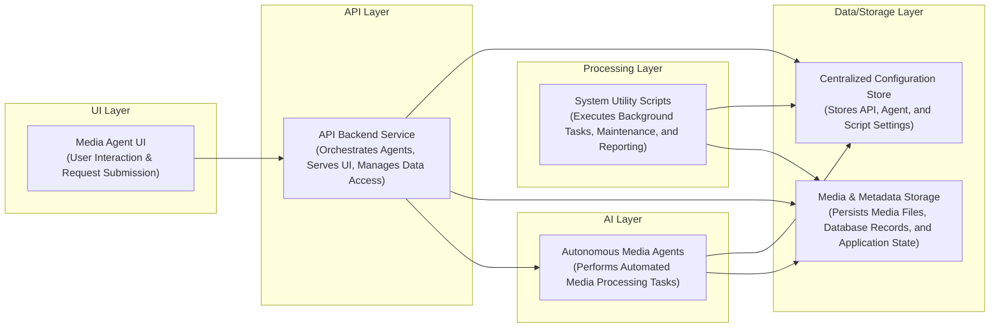

# Media Agent

## Overview
Media Agent is an intelligent system designed to streamline and automate various tasks related to media management and processing. Developed primarily in Python, this project leverages autonomous agents, a user interface, and robust API endpoints to offer a comprehensive solution for efficient media handling.

## Business Problem
In today's data-rich environments, managing, processing, and interacting with media assets can be complex and time-consuming. This project addresses the need for an automated and centralized platform to reduce manual effort, improve operational efficiency, and provide programmatic control over media-related workflows. It aims to solve problems such as content organization, automated processing, integration with external services, and providing a user-friendly interface for control and monitoring.

## Key Capabilities
*   **Project Setup & Configuration**: Structured for easy setup and configuration using environment variables and dedicated configuration files.
*   **Code Organization**: Clearly separated components for frontend, backend API, and autonomous agents/scripts for maintainability and scalability.
*   **User Interface (UI)**: Provides an interactive and intuitive interface for users to manage and monitor media operations.
*   **API Endpoints**: Offers a programmatic interface for interacting with the media agent, enabling integration with other systems.
*   **Autonomous Agents/Scripts**: Executes intelligent, self-contained scripts to perform automated tasks and processes related to media.
*   **SharePoint Integration**: Automates the upload of generated video content to a configured SharePoint Media Library, streamlining content distribution.
*   **Automation Scripts**: Includes various utility scripts to automate repetitive tasks and enhance overall system efficiency.
*   **Comprehensive Documentation**: Includes this README to guide users and contributors.

## Tech Stack
*   **Main Language**: Python
*   **Dependency Management**: `pip` (with `requirements.txt`)
*   **Version Control**: Git

## Repository Structure
The repository is organized into distinct directories for clarity and separation of concerns:
*   `.env.local`: Local environment variable configuration.
*   `.gitignore`: Specifies intentionally untracked files to ignore.
*   `agents/`: Contains autonomous agent scripts and logic.
*   `api/`: Houses the backend API services and endpoints.
*   `config/`: Stores configuration files for various parts of the application.
*   `frontend/`: Contains the user interface source code.
*   `requirements.txt`: Lists Python dependencies required for the project.
*   `scripts/`: Holds various utility and automation scripts.

## Local Setup
To set up and run the Media Agent locally, follow these steps:

1.  **Clone the Repository**:
    ```bash
    git clone https://github.com/ramamurthy-540835/media_agent.git
    cd media_agent
    ```

2.  **Set up Python Virtual Environment**:
    ```bash
    python3 -m venv .venv
    source .venv/bin/activate  # On Windows, use `.venv\Scripts\activate`
    ```

3.  **Install Dependencies**:
    ```bash
    pip install -r requirements.txt
    ```

4.  **Configure Environment Variables**:
    Create a `.env.local` file in the root directory and populate it with necessary environment variables. Refer to any `.env.example` or documentation within the `config/` directory for required variables (e.g., API keys, database connections).

5.  **Run Components**:
    *   **Backend API**: Navigate to the `api/` directory and run the API server.
        ```bash
        # Example command, actual command may vary based on framework (e.g., Flask, FastAPI, Django)
        # cd api
        # python app.py  # or uvicorn main:app --reload
        ```
    *   **Frontend UI**: Navigate to the `frontend/` directory and start the development server.
        ```bash
        # Example command, actual command may vary based on framework (e.g., npm start, yarn dev)
        # cd frontend
        # npm install
        # npm start
        ```
    *   **Agents/Scripts**: Individual agents or scripts can be run as needed.
        ```bash
        # Example: Run a specific agent
        # python agents/my_media_processor.py
        ```

## Deployment
Given the multi-component nature (frontend, backend API, agents), a typical deployment would involve:

1.  **Containerization**: Using Docker to containerize the frontend, backend API, and potentially individual agents for isolated and consistent environments.
2.  **Orchestration**: Deploying containers to a cloud platform (e.g., AWS ECS/EKS, Google Cloud Run/GKE, Azure App Services) using tools like Kubernetes or Docker Compose.
3.  **Environment Configuration**: Securely injecting environment variables at deployment time.
4.  **Persistent Storage**: Setting up persistent storage solutions for any data managed by the agent.
5.  **CI/CD Pipeline**: Implementing a CI/CD pipeline for automated testing, building, and deployment upon code changes.

## Demo Workflow
1.  **Access the UI**: Open your web browser and navigate to the local address where the frontend is running (e.g., `http://localhost:3000`).
2.  **Upload/Select Media**: Use the UI to upload new media files or select existing ones to be processed by the agent.
3.  **Configure Task**: Through the UI, specify a task for the Media Agent, such as:
    *   Transcoding a video to a different format.
    *   Extracting metadata from an image.
    *   Categorizing media files based on content.
    *   Applying watermarks or branding.
4.  **Initiate Processing**: Trigger the selected task. The UI will communicate with the backend API, which will then dispatch the task to the appropriate autonomous agent.
5.  **Monitor Progress**: Observe the status of the task in the UI, which will display updates received from the API and agents.
6.  **Review Results**: Once completed, the UI will present the processed media or a report of the agent's actions, which can then be downloaded or viewed.
7.  **Programmatic Interaction**: Alternatively, interact directly with the `api/` endpoints using tools like `curl` or Postman to programmatically initiate tasks and retrieve results, bypassing the UI.

## Future Enhancements
*   **Database Integration**: Implement a robust database (e.g., PostgreSQL, MongoDB) for managing media metadata, task queues, and agent states.
*   **Scalability**: Introduce message queuing (e.g., RabbitMQ, Kafka) for asynchronous task processing and horizontal scaling of agents.
*   **Authentication & Authorization**: Implement user management, role-based access control, and secure API keys for enhanced security.
*   **Advanced AI/ML Capabilities**: Integrate advanced machine learning models for intelligent media analysis, content moderation, or recommendation systems.
*   **External Service Integrations**: Develop connectors for popular media platforms, cloud storage, or third-party APIs (e.g., social media, video platforms).
*   **Container Orchestration**: Provide Docker Compose or Kubernetes configurations for easier multi-service deployment.
*   **Testing**: Implement comprehensive unit, integration, and end-to-end tests for all components.
*   **Error Handling & Logging**: Enhance error reporting, recovery mechanisms, and centralized logging for better operational visibility.
## Architecture

Automated Media Processing and Orchestration Platform.



For a standalone preview, see [docs/architecture.html](docs/architecture.html).

### Key Architectural Aspects:
* A web-based user interface enables interaction and submission of media processing requests.
* An API backend service orchestrates autonomous agents and manages data flow between system components.
* Specialized autonomous agents perform core media processing tasks based on user input or triggers.
* A centralized data store handles both media assets, metadata, and critical application configuration.
