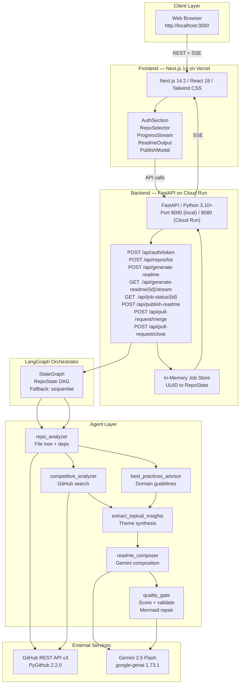
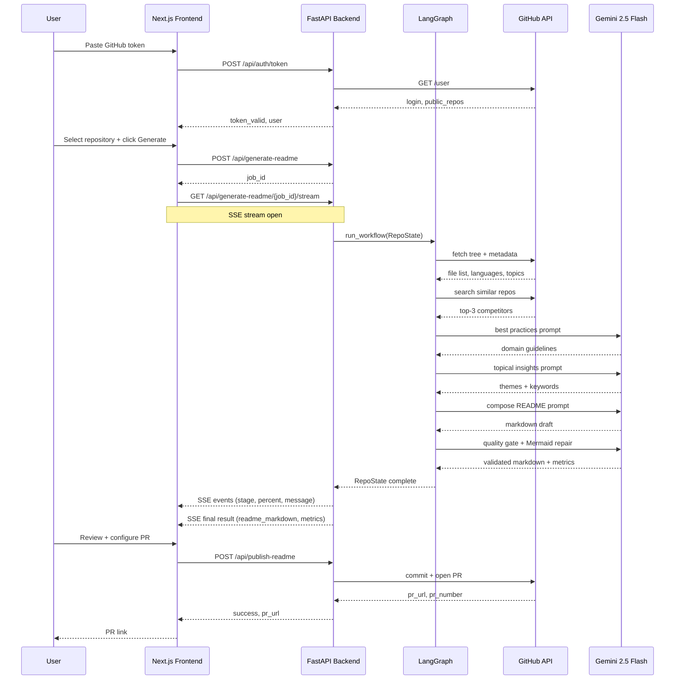
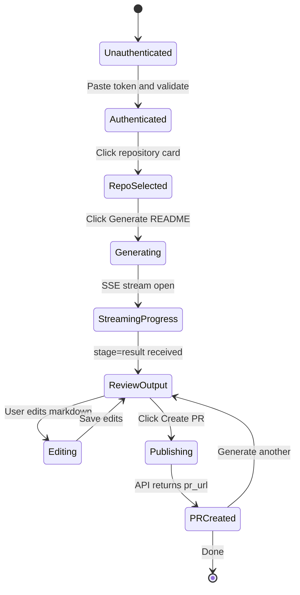
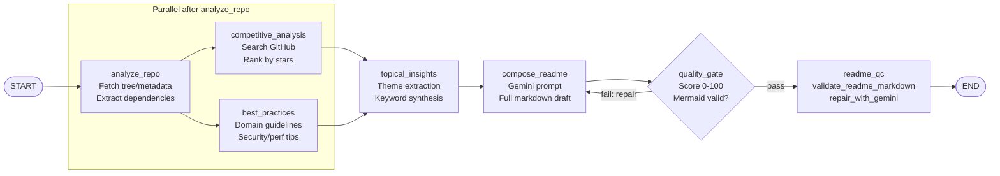
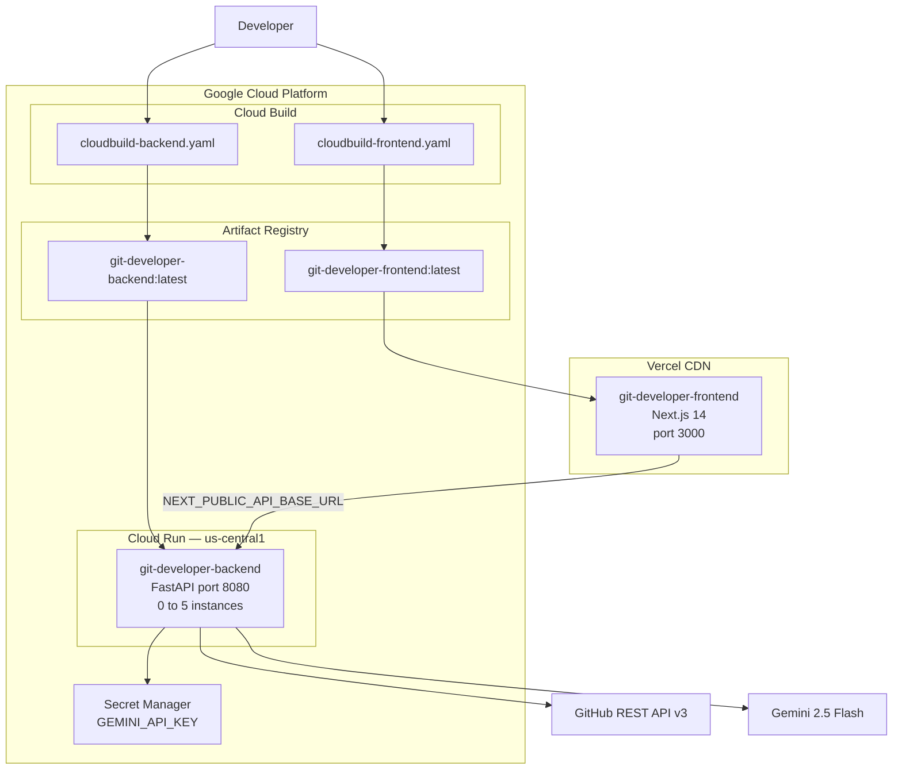

# 🤖 git-developer
**AI-Powered Professional README Generator for GitHub Repositories**

[](https://opensource.org/licenses/MIT)
[](https://www.python.org/)
[](https://nodejs.org/)
[]()
[](https://github.com/ramamurthy-540835/git-developer)

Generate professional, AI-driven READMEs in seconds — with competitive analysis, quality scoring, Mermaid diagram validation, and one-click GitHub PR publishing.

---

## Table of Contents

- [Overview](#overview)
- [Key Features](#key-features)
- [Architecture](#architecture)
- [Tech Stack](#tech-stack)
- [Quick Start](#quick-start)
- [Usage Guide](#usage-guide)
- [API Reference](#api-reference)
- [Project Structure](#project-structure)
- [Governance & Compliance](#governance--compliance)
- [Deployment](#deployment)
- [Performance & Scalability](#performance--scalability)
- [Troubleshooting](#troubleshooting)
- [Contributing](#contributing)
- [Roadmap](#roadmap)
- [License](#license)

---

## Overview

**git-developer** is a multi-agent AI system that produces publication-ready README files for any GitHub repository. Point it at a repo URL, authenticate with a GitHub Personal Access Token, and within 30 seconds the system returns a fully structured, professionally written README — complete with competitive benchmarking, domain best practices, and quality metrics.

The problem it solves is real: most engineering teams treat documentation as an afterthought. README files are either missing, stale, or inconsistent across projects — costing adoption, contributor onboarding time, and organizational credibility. Writing a great README manually takes hours of focused effort that is almost always deprioritized against product work.

git-developer automates the entire workflow. A LangGraph `StateGraph` orchestrator coordinates six specialized Gemini-powered agents — repository analyzer, competitive analyzer, best-practices advisor, topical insights extractor, README composer, and quality gate — that work in a directed acyclic graph. Each agent writes its output into a shared `RepoState` and passes it downstream. Generated markdown is validated for structural completeness and Mermaid diagram syntax; if diagrams fail validation a repair agent patches them automatically and re-validates before delivery. Only a validated README is published to GitHub.

The system is enterprise-ready by design. The backend is a stateless FastAPI service deployed on GCP Cloud Run, the frontend is a Next.js 14 application on Vercel, and generation progress is observable in real time through Server-Sent Events. OSSA governance manifests can be applied to enforce token budgets, audit logging, and cost controls when the tool is deployed at organizational scale.

---

## Key Features

**Multi-Agent LangGraph Orchestration**

git-developer uses a LangGraph `StateGraph` with six specialized nodes coordinated in a directed acyclic graph. Repository analysis and competitive research feed in parallel into a topical insights extractor, which then drives the README composer. The quality gate scores the output and triggers a repair loop if Mermaid validation fails. If the LangGraph runtime is unavailable the orchestrator falls back to a safe sequential execution path — generation always completes rather than throwing a 500 to the user. Every stage appends a structured event `{stage, percent, message, ts}` to the shared job store, which the SSE endpoint streams to the browser.

**Competitive Intelligence**

Every generated README includes automated competitive benchmarking. The competitive analyzer searches GitHub for repositories with similar names and descriptions, ranks the top three by star count, and passes them as context to the composer. The output includes a positioning section derived from the delta between your repo profile and the competitive set — automatically highlighting what makes your project distinct, without any manual input.

**Real-Time Progress Streaming**

Generation progress is streamed to the browser via Server-Sent Events on `GET /api/generate-readme/{job_id}/stream`. The backend polls the in-memory job store at 700ms intervals and flushes new events as they arrive. The frontend renders a live stage-by-stage progress indicator so users always know what the system is doing across the 25–35 second generation window.

**Mermaid Validation and Auto-Repair**

Generated READMEs are validated before delivery using `validate_readme_markdown()`, which checks for invalid sequence arrow patterns (`-<<`), unsupported Unicode characters (`←→`), and pipe separators in `stateDiagram-v2` labels that cause GitHub's renderer to fail silently. If any issues are found, `repair_readme_with_gemini()` sends a focused repair prompt to Gemini with precise fix rules, then re-validates the output. Only a repair-passing README is published — broken diagrams never ship.

**One-Click GitHub PR Publishing**

After reviewing the generated markdown the user fills in a PR metadata form — branch name, commit message, PR title (up to 100 chars), and PR body (up to 5,000 chars) — and clicks publish. The backend commits the file to the specified branch, opens a pull request via PyGithub, and returns the PR URL. Additional endpoints support merging or closing existing PRs directly from the interface without switching to GitHub.

**Quality Scoring**

The quality gate node scores every README before delivery: overall quality (0–100), completeness percentage, estimated reading time in minutes, section coverage checklist, and actionable improvement suggestions. This metadata is returned alongside the markdown and rendered in a side panel so users understand not just what was generated but how good it is.

---

## Architecture

### System Architecture



### Generation Pipeline



### Frontend User Flow



### LangGraph Agent Orchestration



### Deployment Architecture



---

## Tech Stack

git-developer is built on battle-tested, industry-standard technologies chosen for performance, developer ergonomics, and cloud-native deployability.

| Component | Technology | Version | Purpose |
|-----------|-----------|---------|---------|
| **Frontend** | Next.js | 14.2.3 | React framework, SSR, routing |
| | React | 18+ | Component-based UI |
| | Tailwind CSS | 3.4.1 | Utility-first responsive styling |
| | Zustand | 5.0.12 | Lightweight client state management |
| | react-markdown | 10.1.0 | Markdown preview rendering |
| | react-syntax-highlighter | 16.1.1 | Code block syntax highlighting |
| | react-diff-viewer | 4.2.2 | Before/after README comparison |
| | Recharts | 3.8.1 | Quality metrics visualization |
| **Backend** | FastAPI | 0.110.1 | High-performance async Python API |
| | Uvicorn | 0.29.0 | ASGI server |
| | Python | 3.10+ | Core language for all agents |
| | Pydantic | Latest | Request/response validation |
| **AI / LLM** | Gemini 2.5 Flash | Latest | Fast, accurate text generation |
| | google-genai | 1.73.1 | Google Gen AI Python SDK |
| **Orchestration** | LangGraph | Latest | Multi-agent DAG workflow |
| **GitHub** | PyGithub | 2.2.0 | Repository data, PR creation |
| | GitHub REST API | v3 | Auth, search, file ops |
| **Real-time** | Server-Sent Events | Native HTTP | Live progress streaming |
| **Deployment** | Docker | Latest | Containerization |
| | GCP Cloud Run | — | Serverless backend auto-scaling |
| | Vercel | — | Frontend CDN + edge hosting |
| | GCP Cloud Build | — | CI/CD pipeline |

---

## Quick Start

### Prerequisites

- Python 3.10+
- Node.js 18+ with npm
- Git
- **GitHub Personal Access Token** with scopes `repo`, `public_repo`
- **Gemini API Key** — free tier available at [aistudio.google.com](https://aistudio.google.com)

### Installation

```bash
# Clone repository
git clone https://github.com/ramamurthy-540835/git-developer.git
cd git-developer

# Backend: create virtualenv and install dependencies
python -m venv venv
source venv/bin/activate        # Windows: venv\Scripts\activate
pip install -r requirements.txt

# Frontend: install Node dependencies
cd frontend && npm install && cd ..
```

### Configuration

```bash
# Backend secrets (root .env.local)
GEMINI_API_KEY=your_gemini_api_key_here
GITHUB_TOKEN=ghp_xxxxxxxxxxxxxxxxxxxx
PORT=8000

# Frontend (frontend/.env.local)
NEXT_PUBLIC_API_BASE_URL=http://localhost:8000
NEXT_PUBLIC_APP_NAME=git-developer
```

### Run Locally

```bash
# Terminal 1 — Backend (port 8000)
source venv/bin/activate
python -m uvicorn api.main:app --reload --host 0.0.0.0 --port 8000

# Terminal 2 — Frontend (port 3000)
cd frontend && npm run dev
```

Open **http://localhost:3000** in your browser.

---

## Usage Guide

**Step 1 — Authenticate with GitHub**

Paste your GitHub Personal Access Token into the authentication panel and click Validate. The system calls `POST /api/auth/token`, verifies the token, and displays your username and public repository count. The token is held in browser memory and transmitted only over HTTPS — it is never stored server-side.

**Step 2 — Select a Repository**

Browse your public repositories in a searchable list. Each card shows the repository name, description, star count, primary language, and last-updated timestamp. Click any card to select it.

**Step 3 — Generate README**

Click **Generate README** to start the job. The backend creates a UUID-keyed job and immediately returns a `job_id`. The frontend opens a Server-Sent Events stream and renders live progress:

| Stage | Approx. Time | What happens |
|-------|-------------|-------------|
| Repository Analysis | 3–5 s | Fetches file tree, dependencies, topics, languages |
| Competitive Research | 5–8 s | Searches GitHub for similar repos, ranks by stars |
| Best Practices | 3–5 s | Generates domain-specific guidelines via Gemini |
| Topical Insights | 2–3 s | Extracts themes and keywords across all context |
| README Composition | 10–15 s | Gemini writes the full markdown document |
| Quality Gate + QC | 3–5 s | Scores output, validates and repairs Mermaid diagrams |

**Step 4 — Review and Edit**

The generated README appears in a split view: markdown preview on the left, quality metrics panel on the right (overall score 0–100, completeness %, estimated reading time, section checklist). Edit the markdown inline if needed.

**Step 5 — Publish to GitHub**

Click **Create PR** to open the publish dialog. Configure:
- **Branch** — target branch (default: `docs/update-readme`)
- **Commit message** — default: `docs: update README`
- **PR Title** — max 100 characters
- **PR Body** — max 5,000 characters

Click **Publish** to commit the file and open a GitHub pull request. The PR URL is returned as a clickable link. You can also merge or close the PR directly from the interface without switching to GitHub.

---

## API Reference

All endpoints are prefixed `/api`. Base URL: `http://localhost:8000` locally, `https://git-developer-backend-*.run.app` on Cloud Run.

### `POST /api/auth/token`
Validate a GitHub token and retrieve user info.

```json
// Request
{ "github_token": "ghp_xxxxxxxxxxxxxxxxxxxx" }

// Response
{ "token_valid": true, "user": { "login": "ramamurthy-540835", "public_repos": 35 } }
```

### `POST /api/repos/list`
List the authenticated user's public repositories.

```json
// Request
{ "github_token": "ghp_xxxxxxxxxxxxxxxxxxxx" }

// Response
{ "repos": [{ "name": "git-developer", "url": "...", "stars": 42, "language": "Python" }] }
```

### `POST /api/generate-readme`
Start a README generation job. Returns immediately with a `job_id`.

```json
// Request
{ "repo_url": "https://github.com/ramamurthy-540835/git-developer", "github_token": "ghp_..." }

// Response
{ "job_id": "a1b2c3d4e5f6g7h8i9j0" }
```

### `GET /api/generate-readme/{job_id}/stream`
Server-Sent Events stream. Each event is a JSON object on a `data:` line.

```
data: {"stage": "repo_analyzer", "percent": 30, "message": "Scanning file tree...", "ts": "2026-05-05T10:30:45Z"}

data: {"stage": "competitive_analyzer", "percent": 55, "message": "Found 3 similar projects", "ts": "2026-05-05T10:30:51Z"}

data: {"stage": "result", "status": "completed", "result": {"readme_markdown": "# ...", "metrics": {"quality_score": 87}}}
```

### `GET /api/job-status/{job_id}`
Poll job status (fallback to SSE).

```json
{
  "job_id": "a1b2c3d4...",
  "status": "completed",
  "message": "Generation complete",
  "result": { "readme_markdown": "# ...", "metrics": { "quality_score": 87 } },
  "error": null
}
```

### `POST /api/publish-readme`
Validate, optionally repair, commit, and open a GitHub PR.

```json
// Request
{
  "repo_url": "https://github.com/ramamurthy-540835/git-developer",
  "readme_markdown": "# git-developer\n...",
  "github_token": "ghp_...",
  "branch": "docs/update-readme",
  "commit_message": "docs: add generated README",
  "pr_title": "docs: add professional README",
  "pr_body": "Auto-generated by git-developer."
}

// Response
{
  "success": true,
  "pr_url": "https://github.com/ramamurthy-540835/git-developer/pull/42",
  "pr_number": 42,
  "readme_repaired": false,
  "validation": { "valid": true, "repaired": false, "errors": [] }
}
```

### `POST /api/pull-request/merge`
Merge an open PR (merge methods: `merge`, `squash`, `rebase`).

```json
{ "repo_url": "...", "github_token": "ghp_...", "pr_number": 42, "merge_method": "squash" }
```

### `POST /api/pull-request/close`
Close a PR without merging.

```json
{ "repo_url": "...", "github_token": "ghp_...", "pr_number": 42 }
```

### `GET /health`
Health check.

```json
{ "ok": true, "service": "git-developer-readme-api" }
```

---

## Project Structure

```
git_agent/
├── README.md                        # This file
├── requirements.txt                 # Python dependencies
├── Dockerfile.backend               # Backend container image
├── cloudbuild-backend.yaml          # GCP Cloud Build — backend pipeline
├── cloudbuild-frontend.yaml         # GCP Cloud Build — frontend pipeline
├── .dockerignore
├── .gitignore
│
├── api/
│   ├── main.py                      # FastAPI app, CORS, router registration
│   ├── readme_routes.py             # All /api/* endpoints + in-memory job store
│   └── __init__.py
│
├── agents/
│   ├── repo_analyzer.py             # Fetch file tree, extract deps/languages
│   ├── competitive_analyzer.py      # GitHub search, rank competitors by stars
│   ├── best_practices_advisor.py    # Domain-specific guidelines via Gemini
│   ├── readme_composer.py           # Compose, score, validate, repair markdown
│   ├── github_reader_agent.py       # GitHub file reading utilities
│   ├── shared_github.py             # PyGithub wrappers: fetch, list, publish
│   ├── llm.py                       # google-genai client wrapper
│   └── __init__.py
│
├── orchestrator/
│   └── langgraph_workflow.py        # LangGraph StateGraph + sequential fallback
│
├── scripts/
│   ├── generate_repos_yaml.py       # Batch: export all repos to YAML
│   ├── enrich_repos_yaml.py         # Batch: enrich YAML with metadata
│   ├── generate_readme_drafts.py    # Batch: generate READMEs from YAML list
│   └── run_pipeline.py              # CLI entrypoint for local pipeline runs
│
├── config/
│   ├── repos.yaml                   # Repo list for batch operations
│   ├── repos.generated.yaml         # Enriched repo profiles (auto-generated)
│   └── repo_profile.yaml            # Example repo profile schema
│
└── frontend/
    ├── package.json                 # Next.js 14, Zustand, react-markdown, recharts
    ├── next.config.mjs              # Next.js configuration
    ├── tailwind.config.js           # Tailwind CSS theme
    ├── Dockerfile                   # Frontend container image (node:20-alpine)
    └── app/                         # Next.js app router pages
```

---

## Governance & Compliance

git-developer integrates with **OSSA (Open Standard for Service Agents)** for enterprise compliance, cost control, and audit logging.

### OSSA Agent Manifest

```yaml
apiVersion: ossa/v0.4.6
kind: Agent
metadata:
  name: git-developer-readme-generator
  description: Multi-agent README generation pipeline using LangGraph and Gemini 2.5 Flash
  owner: ramamurthy.valavandan@mastechdigital.com
  team: platform-engineering

spec:
  llm:
    provider: google
    model: gemini-2.5-flash
    temperature: 0.7
    maxOutputTokens: 8192

  tools:
    - name: github_api
      description: Read repository metadata, file tree, and create pull requests
      external: true
    - name: github_search
      description: Search GitHub for competitive repositories
      external: true

  compliance:
    frameworks: [SOC2]
    dataClassification: internal
    pii: false

  cost:
    tokenBudget:
      perExecution: 8192
      perDay: 200000
    spendLimits:
      daily: 20.00
      monthly: 400.00
    alertThresholds:
      daily: 15.00

  hitl:
    enabled: true
    interventionPoints:
      - before_publish: "User reviews and approves markdown before PR is created"
    reviewTimeout: 300s

  audit:
    enabled: true
    retention: 90days
    events:
      - generation_started
      - generation_completed
      - readme_published
      - pr_merged
      - pr_closed

  security:
    dataRetention: 30days
    encryption: TLS1.3
    secretsBackend: gcp-secret-manager
    tokenScope: [repo, public_repo]
```

### Cost Governance

The quality gate and repair loop add at most one additional Gemini call per generation. At current Gemini 2.5 Flash pricing this yields an average cost of ~$0.02–0.05 per README. Daily spend limits in the OSSA manifest trigger alerts before hard budget caps are reached.

### Human-in-the-Loop

The system enforces a mandatory review step before any content is published to GitHub. The API does not auto-publish; the user must explicitly review the generated README, optionally edit it, configure PR metadata, and click Publish. This HITL checkpoint is registered in the OSSA manifest as `before_publish`.

### Audit Logging

Every generation, publish, merge, and close event is recorded with the job ID, GitHub login, repository URL, timestamp, and outcome. The 90-day retention window satisfies SOC2 Type II audit trail requirements. Logs flow to GCP Cloud Logging when deployed on Cloud Run and are queryable via the GCP Console or `gcloud logging read`.

---

## Deployment

### Local Development

```bash
# Backend (port 8000)
source venv/bin/activate
python -m uvicorn api.main:app --reload --host 0.0.0.0 --port 8000

# Frontend (port 3000)
cd frontend && npm run dev
```

### Docker

```bash
# Backend
docker build -f Dockerfile.backend -t git-developer-backend .
docker run -p 8000:8080 --env-file .env.local git-developer-backend

# Frontend
docker build -f frontend/Dockerfile -t git-developer-frontend ./frontend
docker run -p 3000:3000 \
  -e NEXT_PUBLIC_API_BASE_URL=http://localhost:8000 \
  git-developer-frontend
```

### GCP Cloud Run (Production)

```bash
# Backend
gcloud builds submit --config=cloudbuild-backend.yaml --project=ctoteam .

# Frontend
gcloud builds submit --config=cloudbuild-frontend.yaml --project=ctoteam .
```

Both pipelines build, push to Artifact Registry, and deploy to Cloud Run in `us-central1`. `GEMINI_API_KEY` is injected from GCP Secret Manager at runtime — no secrets in images or YAML files.

### Environment Variables

```bash
# Backend (.env.local)
GEMINI_API_KEY=your_gemini_api_key
PORT=8000

# Frontend (frontend/.env.local)
NEXT_PUBLIC_API_BASE_URL=http://localhost:8000
NEXT_PUBLIC_APP_NAME=git-developer
```

---

## Performance & Scalability

| Metric | Value |
|--------|-------|
| Average generation time | 25–35 seconds |
| SSE poll interval | 700 ms |
| Cloud Run instances | 0–5 (scale to zero) |
| GitHub API rate limit | 5,000 requests / hour per token |
| Max README output | ~50 KB markdown |
| Job store | In-process memory — replace with Redis for multi-instance deployments |

---

## Troubleshooting

**Token validation returns `token_valid: false`**  
Ensure the token has `repo` and `public_repo` scopes. Tokens in GitHub orgs with SSO must be authorized under [token settings](https://github.com/settings/tokens).

**Repository not found / 404 from GitHub**  
Confirm the repository is public and the URL is copied from the browser (not the SSH clone URL).

**Generation completes but `readme_markdown` is empty**  
Check the `errors` array in the SSE `result` event. Most common cause: Gemini API quota exhausted — verify the API key is active.

**Mermaid diagrams not rendering on GitHub**  
The `validate_readme_markdown` + `repair_readme_with_gemini` chain should catch this. If diagrams still break, look in the raw file for `-<<` arrows or unquoted `|` characters in `stateDiagram-v2` blocks.

**PR creation fails with `404 ref not found`**  
The target branch must exist before publishing. Create it with `git checkout -b docs/update-readme && git push origin docs/update-readme`, or change the branch name to `main`.

**Cloud Run returns 500 on cold start**  
Confirm `GEMINI_API_KEY` is in Secret Manager and the service account has `secretmanager.secretAccessor` role.

---

## Contributing

Contributions are welcome. Follow these steps:

1. Fork the repository
2. Create a feature branch: `git checkout -b feature/your-feature`
3. Commit: `git commit -m 'feat: describe your change'`
4. Push: `git push origin feature/your-feature`
5. Open a pull request against `main`

**Guidelines**
- Follow PEP 8 for Python; ESLint + Next.js defaults for JavaScript
- Keep agents stateless — all state flows through `RepoState`
- Do not commit `.env.local` or any secrets
- Update this README if you add or change an API endpoint

---

## Roadmap

- [ ] GitHub OAuth — eliminate manual token paste
- [ ] Batch processing UI — generate READMEs for all repos in a YAML list
- [ ] Generation history — versioned README archive per repository
- [ ] Custom prompt templates — organization-branded README schemas
- [ ] PDF and DOCX export
- [ ] Multi-language README support
- [ ] Webhook trigger — auto-regenerate README on push to `main`
- [ ] Advanced analytics dashboard (token usage, quality trends, cost per repo)
- [ ] Team workspace — shared token pool, role-based access

---

## License

MIT License — see [LICENSE](LICENSE) for details.

---

## Acknowledgments

Built with:
- **LangGraph** for multi-agent workflow orchestration
- **FastAPI** for high-performance async API
- **Next.js 14** for modern React frontend
- **Gemini 2.5 Flash** for fast natural language generation
- **PyGithub** for seamless GitHub integration
- **OSSA** for enterprise AI governance

---

*Last Updated: May 5, 2026 · Version 1.0.0 · Maintained by [ramamurthy-540835](https://github.com/ramamurthy-540835)*
